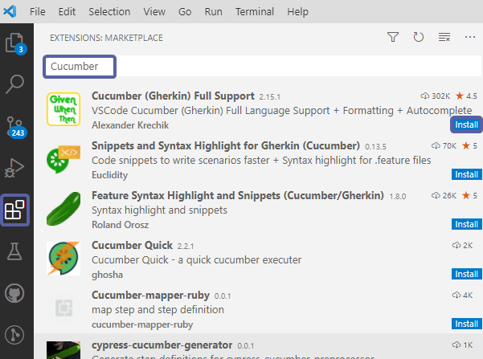
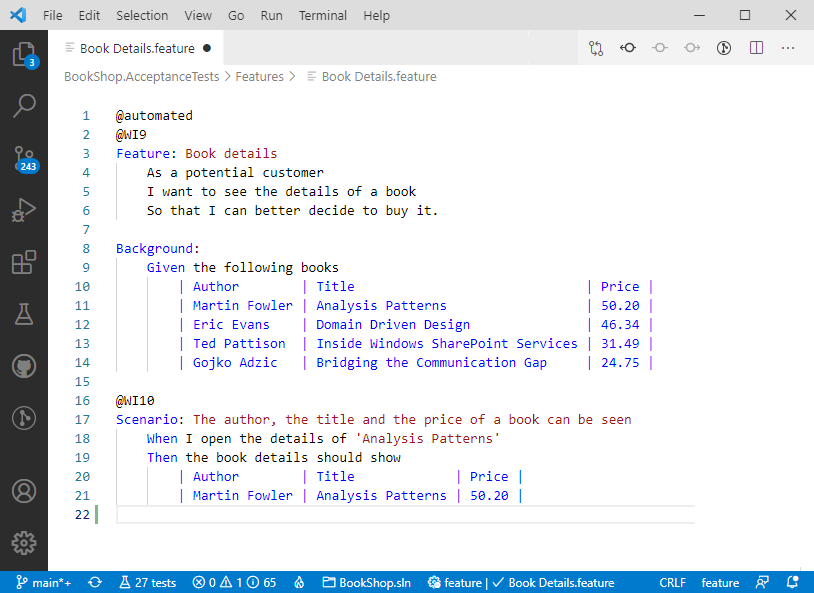
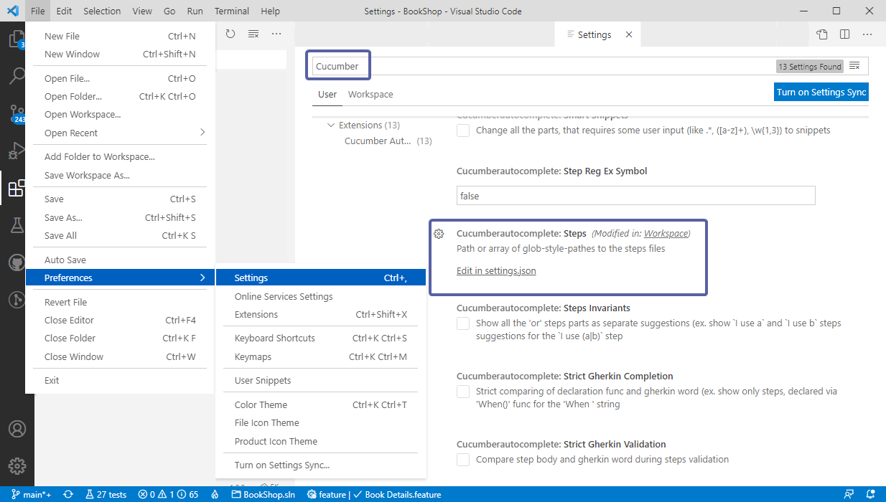

# Installation

Although there is **no official** Reqnroll for Visual Studio Code extension available right now, we have put together this guide to help you have an experience as close as possible to a Reqnroll Extension.

If you like to see an official Reqnroll extension for VS Code please vote for it on our community feature request page [here](https://support.reqnroll.net/hc/en-us/community/posts/360015049478--Reqnroll-for-Visual-Studio-Code). You can also vote on other existing requests by other community members.

Note we do have an official extension for Visual Studio, more details [here](https://docs.reqnroll.net/projects/reqnroll/en/latest/visualstudio/visual-studio-installation.html)

---

We recommend installing the [Cucumber (Gherkin) Full Support](https://marketplace.visualstudio.com/items?itemName=alexkrechik.cucumberautocomplete) extension for Visual Studio Code to enable key features such as syntax highlighting, Auto-completion of steps, and table formatting.

You can install this extension through the [Visual Studio Marketplace](https://marketplace.visualstudio.com/items?itemName=alexkrechik.cucumberautocomplete) or through VS code IDE itself:

**1-** Open VS Code and navigate to ***Extensions*** and search for **Cucumber** in the search box and hit ***Install***:

The extension enables the following features:

- Syntax highlight
- Basic Snippets support
- Auto-parsing of feature steps from paths, provided in settings.json
- Autocompletion of steps
- Definitions support for all the steps parts
- Document format support, including tables formatting
- Supporting of many spoken languages
- Gherkin page objects native support
- Multiple programming languages, C#, JS, TS, Ruby, Kotlin etc.

These features will nicely format and highlight your Gherkin files:

There is an important and handy feature missing here which is the navigation between feature files and their respective step definitions (bindings). Fortunately, we can enable this with a simple tweak in the extension's settings:

**2-** Navigate to ***File ➡ Preferences➡ Settings*** and look for **Cucumber** in the settings search box

**3-** Click on ***Edit in setting.json*** under the **Steps** settings:

As the settings describes, you have to insert the path or array of glob-style-paths to the step definition files in your project. If you have been using a Reqnroll template project your step definition files would be in a folder called *StepDefinitions* so you would enter the path as per below:

**4-** Save your settings and go back to your feature files. You will now be able to navigate from your feature files steps to their corresponding bindings by pressing **F12** or by holding **Ctrl** and clicking on a step:

